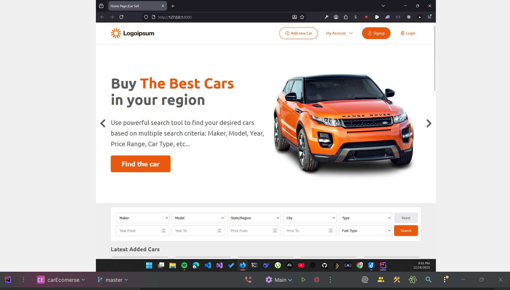
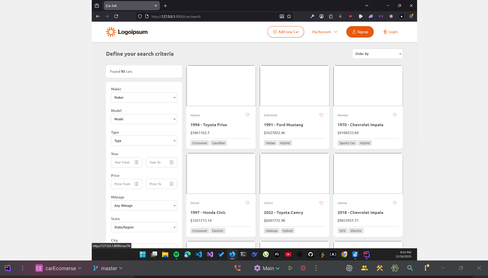
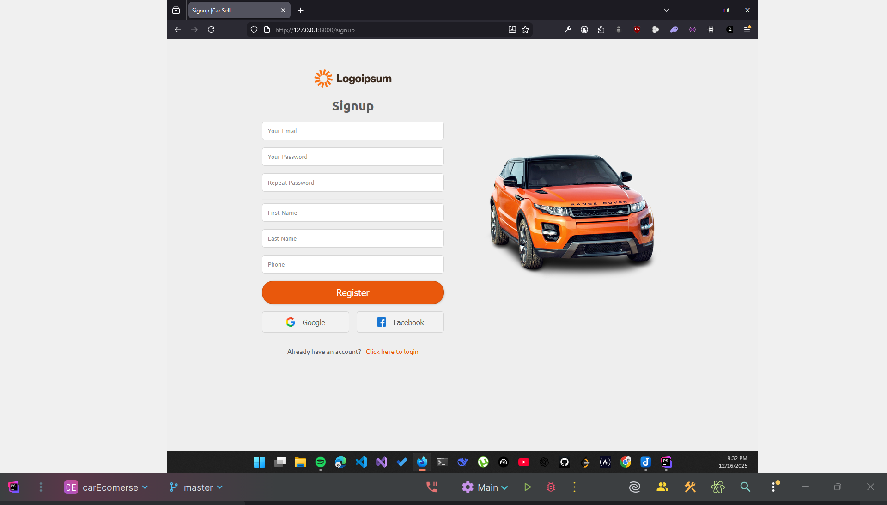
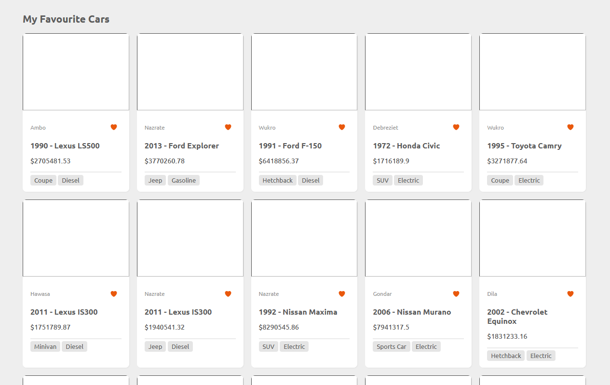

# CarEcomerceWithLaravelBladeAndSQLite

Compact Laravel application that demonstrates a small car e-commerce website built with Blade views and an SQLite database. It includes features to list cars, view details, create/edit cars (admin-style forms), and a simple search.

This repository uses Blade components for UI, Eloquent models for data, and SQLite as the default local database for convenience.

## Quick overview

-   Framework: Laravel (Blade templating)
-   Database: SQLite (used for local development)
-   Assets: Vite / Laravel Mix compatible setup via `package.json` (see project)
-   Tests: Pest / PHPUnit (basic project scaffolding included)

## Features

-   Car listing and detail views
-   Create / edit car pages (forms)
-   Car images and features (models and migrations included)
-   Simple search and filtering
-   Example seeders and factories for demo data

## Prerequisites

-   PHP 8+ (check `composer.json` for exact requirements)
-   Composer
-   Node.js + npm
-   Git (clone the repo)

On Windows, use the WSL/bash shell or Git Bash for the commands below if needed.

## Setup (local development)

1. Clone the repository and enter the project folder:

    git clone <your-repo-url>
    cd "c:\Users\User\Desktop\Coding Projects\Laravel\carEcomerse"

2. Install PHP dependencies:

    composer install

3. Install Node dependencies and build assets (dev):

    npm install
    npm run dev

4. Environment configuration:

    - Copy the example env and set the application key:

        cp .env.example .env
        php artisan key:generate

    - Switch to SQLite by editing `.env` or setting these values:

        DB_CONNECTION=sqlite
        DB_DATABASE="${PWD}/database/database.sqlite"

        Create the SQLite database file if it doesn't exist:

        touch database/database.sqlite

        (On Windows using bash.exe, `touch` will work in Git Bash / WSL; you can also create the file via Explorer.)

5. Run migrations and seeders:

    php artisan migrate --seed

6. (Optional) Link storage for public access (if images are stored via storage):

    php artisan storage:link

7. Start the development server:

    php artisan serve

    Then open http://127.0.0.1:8000 in your browser.

## Running tests

This project includes Pest/PHPUnit scaffolding. Run tests with:

    ./vendor/bin/pest

or

    php artisan test

## Database and seed data

There are factories and seeders in `database/factories` and `database/seeders/DatabaseSeeder.php` which will populate the database with example cars, makers, models, and images. Use `php artisan migrate --seed` to create and seed the database.

## Project structure (high level)

-   `app/Models/` - Eloquent models (Car, CarImage, CarFeatures, Maker, Model, City, State, etc.)
-   `app/Http/Controllers/` - Controllers for web routes (CarController, HomeController, auth controllers)
-   `resources/views/` - Blade views and components (layouts, partials, car views)
-   `database/migrations/` - Migration files for schema
-   `database/factories/` - Model factories for tests and seeders

## Common troubleshooting

-   If migrations fail, ensure the `.env` DB settings point to `sqlite` and the `database/database.sqlite` file exists and is writable.
-   If assets are not loading, run `npm run dev` (for development) or `npm run build` (for production) and clear view caches:

    php artisan view:clear
    php artisan cache:clear

-   If uploaded images don't appear, ensure you ran `php artisan storage:link` and that files exist under `storage/app/public`.

## Next steps / Suggested improvements

-   Add authentication (Laravel Breeze/Jetstream) to provide proper user registration/login flows.
-   Implement pagination and more advanced search/filter options.
-   Add integration tests and E2E tests for the car flows.
-   Replace SQLite with MySQL/Postgres for production use.

## License

This project uses the MIT license via the underlying Laravel framework. See project files for exact licensing.

---

If you want, I can also:

-   add a minimal `.env.example` snippet tuned for SQLite,
-   create a short script to create the `database/database.sqlite` file automatically, or
-   wire up Laravel Breeze for basic auth.

Tell me which of those you'd like next.

## Screenshots

### Home page

  

### Search

  

### Signup

  

### Watchlist

  

